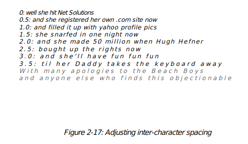

#Graphics and Text with `pdfgen`

##Basic Concepts

The `pdfgen` package is the lowest level interface for
generating PDF documents.  A `pdfgen` program is essentially
a sequence of instructions for "painting" a document onto
a sequence of pages.  The interface object which provides the
painting operations is the `pdfgen canvas`.


The canvas should be thought of as a sheet of white paper
with points on the sheet identified using Cartesian `(X,Y)` coordinates
which by default have the `(0,0)` origin point at the lower
left corner of the page.  Furthermore the first coordinate `x`
goes to the right and the second coordinate `y` goes up, by
default.


A simple example program that uses a canvas follows.


    from reportlab.pdfgen import canvas
    def hello(c):
        c.drawString(100,100,"Hello World")
    c = canvas.Canvas("hello.pdf")
    hello(c)
    c.showPage()
    c.save()


The above code creates a `canvas` object which will generate
a PDF file named `hello.pdf` in the current working directory.
It then calls the `hello` function passing the `canvas` as an argument.
Finally the `showPage` method saves the current page of the canvas
and the `save` method stores the file and closes the canvas.


The `showPage` method causes the `canvas` to stop drawing on the
current page and any further operations will draw on a subsequent
page (if there are any further operations -- if not no
new page is created).  The `save` method must be called after the
construction of the document is complete -- it generates the PDF
document, which is the whole purpose of the `canvas` object.


##More about the Canvas

Before describing the drawing operations, we will digress to cover
some of the things which can be done to configure a canvas.  There
are many different settings available.  If you are new to Python
or can't wait to produce some output, you can skip ahead, but
come back later and read this!

First of all, we will look at the constructor
arguments for the canvas:

    def __init__(self,filename,
                 pagesize=(595.27,841.89),
                 bottomup = 1,
                 pageCompression=0,
                 encoding=rl_config.defaultEncoding,
                 verbosity=0
                 encrypt=None):
                 

The `filename` argument controls the
name of the final PDF file.  You
may also pass in any open binary stream (such as `sys.stdout`, the python process standard output with a binary encoding)
and the PDF document will be written to that.  Since PDF
is a binary format, you should take care when writing other
stuff before or after it; you can't deliver PDF documents
inline in the middle of an HTML page!

The `pagesize` argument is a tuple of two numbers
in points (1/72 of an inch). The canvas defaults to `A4` (an international standard
page size which differs from the American standard page size of `letter`),
but it is better to explicitly specify it.  Most common page
sizes are found in the library module `reportlab.lib.pagesizes`,
so you can use expressions like

	from reportlab.lib.pagesizes import letter, A4
	myCanvas = Canvas('myfile.pdf', pagesize=letter)
	width, height = letter  #keep for later


**Note** - if you have problems printing your document make sure you
are using the right page size (usually either `A4` or `letter`).
Some printers do not work well with pages that are too large or too small.

Very often, you will want to calculate things based on
the page size.  In the example above we extracted the width and
height.  Later in the program we may use the `width` variable to
define a right margin as `width - inch` rather than using
a constant.  By using variables the margin will still make sense even
if the page size changes.

The `bottomup` argument
switches coordinate systems.  Some graphics systems (like PDF
and PostScript) place (0,0) at the bottom left of the page
others (like many graphical user interfaces [GUI's]) place the origin at the top left.  The
`bottomup` argument is deprecated and may be dropped in future

The `pageCompression` option determines whether the stream
of PDF operations for each page is compressed.  By default
page streams are not compressed, because the compression slows the file generation process.
If output size is important set `pageCompression=1`, but remember that, compressed documents will
be smaller, but slower to generate.  Note that images are <i>always</i> compressed, and this option
will only save space if you have a very large amount of text and vector graphics
on each page.

The `encoding` argument is largely obsolete in version 2.0 and can
probably be omitted by 99% of users.  Its default value is fine unless you
very specifically need to use one of the 25 or so characters which are present
in MacRoman and not in Winansi.  A useful reference to these is here:
<font color="blue"><u><a href="http://www.alanwood.net/demos/charsetdiffs.html">http://www.alanwood.net/demos/charsetdiffs.html</a></u></font>.

The parameter determines which font encoding is used for the
standard Type 1 fonts; this should correspond to the encoding on your system.
Note that this is the encoding used <i>internally by the font</i>; text you
pass to the ReportLab toolkit for rendering should always either be a Python
unicode string object or a UTF-8 encoded byte string (see the next chapter)!
The font encoding has two values at present: `'WinAnsiEncoding'` or
`'MacRomanEncoding'`.  The variable `rl_config.defaultEncoding` above points
to the former, which is standard on Windows, Mac OS X and many Unices
(including Linux). If you are Mac user and don't have OS X, you may want to
make a global change: modify the line at the top of
<i>reportlab/pdfbase/pdfdoc.py</i> to switch it over.  Otherwise, you can
probably just ignore this argument completely and never pass it.  For all TTF
and the commonly-used CID fonts, the encoding you pass in here is ignored,
since the reportlab library itself knows the right encodings in those
cases.

The demo script `reportlab/demos/stdfonts.py`
will print out two test documents showing all code points
in all fonts, so you can look up characters.  Special
characters can be inserted into string commands with
the usual Python escape sequences; for example \\101 = 'A'.

The `verbosity` argument determines how much log
information is printed.  By default, it is zero to assist
applications which want to capture PDF from standard output.
With a value of 1, you will get a confirmation message
each time a document is generated.  Higher numbers may
give more output in future.

The `encrypt` argument determines if and how the document is encrypted.
By default, the document is not encrypted.
If `encrypt` is a string object, it is used as the user password for the pdf.
If `encrypt` is an instance of `reportlab.lib.pdfencrypt.StandardEncryption`, this object is
used to encrypt the pdf. This allows more finegrained control over the encryption settings.
Encryption is covered in more detail in Chapter 4.

##Drawing Operations

Suppose the `hello` function referenced above is implemented as
follows (we will not explain each of the operations in detail
yet).


eg(examples.testhello)


Examining this code notice that there are essentially two types
of operations performed using a canvas.  The first type draws something
on the page such as a text string or a rectangle or a line.  The second
type changes the state of the canvas such as
changing the current fill or stroke color or changing the current font
type and size.


If we imagine the program as a painter working on
the canvas the "draw" operations apply paint to the canvas using
the current set of tools (colors, line styles, fonts, etcetera)
and the "state change" operations change one of the current tools
(changing the fill color from whatever it was to blue, or changing
the current font to `Times-Roman` in 15 points, for example).


The document generated by the "hello world" program listed above would contain
the following graphics.


	illust(examples.hello, '"Hello World" in pdfgen')

###About the demos in this document


This document contains demonstrations of the code discussed like the one shown
in the rectangle above.  These demos are drawn on a "tiny page" embedded
within the real pages of the guide.  The tiny pages are %s inches wide
and %s inches tall. The demo displays show the actual output of the demo code.
For convenience the size of the output has been reduced slightly.
""" % (examplefunctionxinches, examplefunctionyinches))

##The tools: the "draw" operations


This section briefly lists the tools available to the program
for painting information onto a page using the canvas interface.
These will be discussed in detail in later sections.  They are listed
here for easy reference and for summary purposes.


###Line methods

	canvas.line(x1,y1,x2,y2)
	canvas.lines(linelist)


The line methods draw straight line segments on the canvas.


###Shape methods

	canvas.grid(xlist, ylist) 
	canvas.bezier(x1, y1, x2, y2, x3, y3, x4, y4)
	canvas.arc(x1,y1,x2,y2) 
	canvas.rect(x, y, width, height, stroke=1, fill=0) 
	canvas.ellipse(x1,y1, x2,y2, stroke=1, fill=0)
	canvas.wedge(x1,y1, x2,y2, startAng, extent, stroke=1, fill=0) 
	canvas.circle(x_cen, y_cen, r, stroke=1, fill=0)
	canvas.roundRect(x, y, width, height, radius, stroke=1, fill=0) 


The shape methods draw common complex shapes on the canvas.


###String drawing methods

	canvas.drawString(x, y, text):
	canvas.drawRightString(x, y, text) 
	canvas.drawCentredString(x, y, text)


The draw string methods draw single lines of text on the canvas.


###The text object methods
	textobject = canvas.beginText(x, y) 
	canvas.drawText(textobject) 


Text objects are used to format text in ways that
are not supported directly by the `canvas` interface.
A program creates a text object from the `canvas` using `beginText`
and then formats text by invoking `textobject` methods.
Finally the `textobject` is drawn onto the canvas using
`drawText`.


###The path object methods

	path = canvas.beginPath() 
	canvas.drawPath(path, stroke=1, fill=0, fillMode=None) 
	canvas.clipPath(path, stroke=1, fill=0, fillMode=None) 


Path objects are similar to text objects: they provide dedicated control
for performing complex graphical drawing not directly provided by the
canvas interface.  A program creates a path object using `beginPath`
populates the path with graphics using the methods of the path object
and then draws the path on the canvas using `drawPath`.

It is also possible
to use a path as a "clipping region" using the `clipPath` method -- for example a circular path
can be used to clip away the outer parts of a rectangular image leaving
only a circular part of the image visible on the page.


If `fill=1` is specified then the `fillMode` argument may be used to set either 0=`even-odd` or 1=`non-zero` filling mode.
which will alter the way that complex paths are filled. If the default `None` values is used then the canvas
`_fillMode` attribute value is used (normally `0` ie `even-odd`).

###Image methods
pencilnote()

You need the Python Imaging Library (PIL) to use images with the ReportLab package.
Examples of the techniques below can be found by running the script `test_pdfgen_general.py`
in our `tests` subdirectory and looking at page 7 of the output.


There are two similar-sounding ways to draw images.  The preferred one is
the `drawImage` method.  This implements a caching system so you can
define an image once and draw it many times; it will only be
stored once in the PDF file.  `drawImage` also exposes one advanced parameter,
a transparency mask, and will expose more in future.  The older technique,
`drawInlineImage`, stores bitmaps within the page stream and is thus very
inefficient if you use the same image more than once in a document; but can result
in PDFs which render faster if the images are very small and not repeated. We'll
discuss the oldest one first:


	canvas.drawInlineImage(self, image, x,y, width=None,height=None) 


The `drawInlineImage` method places an image on the canvas.  The `image`
parameter may be either a PIL Image object or an image filename.  Many common
file formats are accepted including GIF and JPEG.  It returns the size of the actual
image in pixels as a (width, height) tuple.


	canvas.drawImage(self, image, x,y, width=None,height=None,mask=None) 

The arguments and return value work as for `drawInlineImage`.  However, we use a caching
system; a given image will only be stored the first time it is used, and just referenced
on subsequent use.  If you supply a filename, it assumes that the same filename
means the same image.  If you supply a PIL image, it tests if the content
has actually changed before re-embedding.


The `mask` parameter lets you create transparent images.  It takes 6 numbers
and defines the range of RGB values which will be masked out or treated as
transparent. For example with [0,2,40,42,136,139], it will mask out any pixels
with a Red value from 0 or 1, Green from 40 or 41 and Blue of  136, 137 or 138
(on a scale of 0-255). It's currently your job to know which color is the
'transparent' or background one.

PDF allows for many image features and we will expose more of the over
time, probably with extra keyword arguments to `drawImage`.

###Ending a page

	canvas.showPage()

The `showPage` method finishes the current page.  All additional drawing will
be done on another page.

pencilnote()

**Warning!**  All state changes (font changes, color settings, geometry transforms, etcetera)
are FORGOTTEN when you advance to a new page in `pdfgen`.  Any state settings you wish to preserve
must be set up again before the program proceeds with drawing!

##The toolbox: the "state change" operations


This section briefly lists the ways to switch the tools used by the
program
for painting information onto a page using the `canvas` interface.
These too will be discussed in detail in later sections.


###Changing Colors
	canvas.setFillColorCMYK(c, m, y, k) 
	canvas.setStrikeColorCMYK(c, m, y, k) 
	canvas.setFillColorRGB(r, g, b) 
	canvas.setStrokeColorRGB(r, g, b) 
	canvas.setFillColor(acolor) 
	canvas.setStrokeColor(acolor) 
	canvas.setFillGray(gray) 
	canvas.setStrokeGray(gray) 


PDF supports three different color models: gray level, additive (red/green/blue or RGB), and
subtractive with darkness parameter (cyan/magenta/yellow/darkness or CMYK).
The ReportLab packages also provide named colors such as `lawngreen`.  There are two
basic color parameters in the graphics state: the `Fill` color for the interior of graphic
figures and the `Stroke` color for the boundary of graphic figures.  The above methods
support setting the fill or stroke color using any of the four color specifications.


###Changing Fonts
	canvas.setFont(psfontname, size, leading = None) 


The `setFont` method changes the current text font to a given type and size.
The `leading` parameter specifies the distance down to move when advancing from
one text line to the next.


###Changing Graphical Line Styles

	canvas.setLineWidth(width) 
	canvas.setLineCap(mode) 
	canvas.setLineJoin(mode) 
	canvas.setMiterLimit(limit) 
	canvas.setDash(self, array=[], phase=0) 


Lines drawn in PDF can be presented in a number of graphical styles.
Lines can have different widths, they can end in differing cap styles,
they can meet in different join styles, and they can be continuous or
they can be dotted or dashed.  The above methods adjust these various parameters.

###Changing Geometry

	canvas.setPageSize(pair) 
	canvas.transform(a,b,c,d,e,f): 
	canvas.translate(dx, dy) 
	canvas.scale(x, y) 
	canvas.rotate(theta) 
	canvas.skew(alpha, beta) 


All PDF drawings fit into a specified page size.  Elements drawn outside of the specified
page size are not visible.  Furthermore all drawn elements are passed through an affine
transformation which may adjust their location and/or distort their appearence.  The
`setPageSize` method adjusts the current page size.  The `transform`, `translate`, `scale`,
`rotate`, and `skew` methods add additional transformations to the current transformation.
It is important to remember that these transformations are <i>incremental</i> -- a new
transform modifies the current transform (but does not replace it).


###State control

	canvas.saveState() 
	canvas.restoreState() 


Very often it is important to save the current font, graphics transform, line styles and
other graphics state in order to restore them later. The `saveState` method marks the
current graphics state for later restoration by a matching `restoreState`.  Note that
the save and restore method invokation must match -- a restore call restores the state to
the most recently saved state which hasn't been restored yet.
You cannot save the state on one page and restore
it on the next, however -- no state is preserved between pages.

##Other `canvas` methods


Not all methods of the `canvas` object fit into the "tool" or "toolbox"
categories.  Below are some of the misfits, included here for completeness.


	 canvas.setAuthor()
	 canvas.addOutlineEntry(title, key, level=0, closed=None)
	 canvas.setTitle(title)
	 canvas.setSubject(subj)
	 canvas.pageHasData()
	 canvas.showOutline()
	 canvas.bookmarkPage(name)
	 canvas.bookmarkHorizontalAbsolute(name, yhorizontal)
	 canvas.doForm()
	 canvas.beginForm(name, lowerx=0, lowery=0, upperx=None, uppery=None)
	 canvas.endForm()
	 canvas.linkAbsolute(contents, destinationname, Rect=None, addtopage=1, name=None, **kw)
	 canvas.linkRect(contents, destinationname, Rect=None, addtopage=1, relative=1, name=None, **kw)
	 canvas.getPageNumber()
	 canvas.addLiteral()
	 canvas.getAvailableFonts()
	 canvas.stringWidth(self, text, fontName, fontSize, encoding=None)
	 canvas.setPageCompression(onoff=1)
	 canvas.setPageTransition(self, effectname=None, duration=1,
	                        direction=0,dimension='H',motion='I')


##Coordinates (default user space)


By default locations on a page are identified by a pair of numbers.
For example the pair `(4.5*inch, 1*inch)` identifies the location
found on the page by starting at the lower left corner and moving to
the right 4.5 inches and up one inch.


For example, the following function draws
a number of elements on a `canvas`.

eg(examples.testcoords)

In the default user space the "origin" ^(0,0)^ point is at the lower
left corner.  Executing the `coords` function in the default user space
(for the "demo minipage") we obtain the following.

	illust(examples.coords, 'The Coordinate System')
	

	

###Moving the origin: the `translate` method

Often it is useful to "move the origin" to a new point off
the lower left corner.  The `canvas.translate(^x,y^)` method moves the origin
for the current page to the point currently identified by ^(x,y)^.

For example the following translate function first moves
the origin before drawing the same objects as shown above.

eg(examples.testtranslate)

This produces the following.

	illust(examples.translate, "Moving the origin: the `translate` method")
	


#illust(NOP) # execute some code


<i>Note:</i> As illustrated in the example it is perfectly possible to draw objects
or parts of objects "off the page".
In particular a common confusing bug is a translation operation that translates the
entire drawing off the visible area of the page.  If a program produces a blank page
it is possible that all the drawn objects are off the page.


###Shrinking and growing: the scale operation

Another important operation is scaling.  The scaling operation `canvas.scale(^dx,dy^)`
stretches or shrinks the ^x^ and ^y^ dimensions by the ^dx^, ^dy^ factors respectively.  Often
^dx^ and ^dy^ are the same -- for example to reduce a drawing by half in all dimensions use
`dx = dy = 0.5`.  However for the purposes of illustration we show an example where
`dx` and `dy` are different.


eg(examples.testscale)

This produces a "short and fat" reduced version of the previously displayed operations.

	illust(examples.scale, "Scaling the coordinate system")


#illust(NOP) # execute some code


<i>Note:</i> scaling may also move objects or parts of objects off the page,
or may cause objects to "shrink to nothing." 

Scaling and translation can be combined, but the order of the
operations are important.

eg(examples.testscaletranslate)

This example function first saves the current `canvas` state
and then does a `scale` followed by a `translate`.  Afterward the function
restores the state (effectively removing the effects of the scaling and
translation) and then does the <i>same</i> operations in a different order.
Observe the effect below.

	illust(examples.scaletranslate, "Scaling and Translating")
	


#illust(NOP) # execute some code


<em>Note:</em> scaling shrinks or grows everything including line widths
so using the canvas.scale method to render a microscopic drawing in
scaled microscopic units
may produce a blob (because all line widths will get expanded a huge amount).
Also rendering an aircraft wing in meters scaled to centimeters may cause the lines
to shrink to the point where they disappear.  For engineering or scientific purposes
such as these scale and translate
the units externally before rendering them using the canvas.

###Saving and restoring the `canvas` state: `saveState` and `restoreState`


The `scaletranslate` function used an important feature of the `canvas` object:
the ability to save and restore the current parameters of the `canvas`.
By enclosing a sequence of operations in a matching pair of `canvas.saveState()`
an `canvas.restoreState()` operations all changes of font, color, line style,
scaling, translation, or other aspects of the `canvas` graphics state can be
restored to the state at the point of the `saveState()`.  Remember that the save/restore
calls must match: a stray save or restore operation may cause unexpected
and undesirable behavior.  Also, remember that <i>no</i> `canvas` state is
preserved across page breaks, and the save/restore mechanism does not work
across page breaks.


###Mirror image


It is interesting although perhaps not terribly useful to note that
scale factors can be negative.  For example the following function


eg(examples.testmirror)


creates a mirror image of the elements drawn by the `coord` function.


	illust(examples.mirror, "Mirror Images")


Notice that the text strings are painted backwards.


##Colors

There are generally two types of colors used in PDF depending on the media where
the PDF will be used. The most commonly known screen colors model RGB can be used
in PDF, however in professional printing another color model CMYK is mainly used 
which gives more control over how inks are applied to paper. More on these color
models below.


###RGB Colors

The `RGB` or additive color representation follows the way a computer
screen adds different levels of the red, green, and blue light to make
any color in between, where white is formed by turning all three lights on full
(`1,1,1`).


There are three ways to specify RGB colors in `pdfgen`: by name (using the `color`
module, by red/green/blue (additive, `RGB`) value, or by gray level.
The `colors` function below exercises each of the four methods.


eg(examples.testRGBcolors)
	illust(examples.colorsRGB, "RGB Color Models")


####RGB Color Transparency


Objects may be painted over other objects to good effect in `pdfgen`.  Generally
There are two modes of handling objects that overlap in space, the default objects 
in the top layer will hide any part of other objects that falls underneath it. If you
need transparency you got two choices:


1. If your document is intended to be printed in a professional way and you are 
working in CMYK color space then you can use overPrint. In overPrinting the colors
physically mix in the printer and thus a new color is obtained. By default a 
knockout will be applied and only top object appears. Read the CMYK section
if this is what you intend to use.


2. If your document is intended for screen output and you are using RGB colors 
then you can set an alpha value, where alpha is the opacity value of the color.
The default alpha value is `1` (fully opaque) and you can use any real number
value in the range 0-1.


Alpha transparency (`alpha`) is similar to overprint but works in RGB color space
this example below demonstrates the alpha funtionality. Refer to our website
http://www.reportlab.com/snippets/ and look for snippets of overPrint and alpha
to see the code that generates the graph below.


eg(examples.testalpha)
	illust(examples.alpha, "Alpha example")


###CMYK Colors

The `CMYK` or subtractive method follows the way a printer
mixes three pigments (cyan, magenta, and yellow) to form colors.
Because mixing chemicals is more difficult than combining light there
is a fourth parameter for darkness.  For example a chemical
combination of the `CMY` pigments generally never makes a perfect
black -- instead producing a muddy color -- so, to get black printers
don not use the `CMY` pigments but use a direct black ink.  Because
`CMYK` maps more directly to the way printer hardware works it may
be the case that colors specified in `CMYK` will provide better fidelity
and better control when printed.


There are two ways of representing CMYK Color: each color can be represented either
by a real value between 0 and 1, or integer value between 0 and 100. Depending
on your preference you can either use CMYKColor (for real values) or PCMYKColor ( for 
integer values). 0 means 'no ink', so printing on white papers gives you white. 1 (or 100
if you use PCMYKColor) means 'the maximum amount of ink'. e.g. CMYKColor(0,0,0,1) is black,
CMYKColor(0,0,0,0) means 'no ink', and CMYKColor(0.5,0,0,0) means 50 percent cyan color.

eg(examples.testCMYKcolors)
	illust(/gexamples.colorsCMYK, "CMYK Color Models")
	


##Color space checking
The `enforceColorSpace` argument of the canvas is used to enforce the consistency
of the colour model used in a document. It accepts these values: CMYK, RGB, SEP, SEP_BLACK,
SEP_CMYK. 'SEP' refers to named color separations such as Pantone spot colors - these can
be mixed with CMYK or RGB according to the parameter used.  The default is 'MIXED' which
allows you to use colors from any color space.  An exception is raised if any colors used
are not convertible to the specified model, e.g. rgb and cmyk (more information in
test_pdfgen_general). This approach doesn't check external images included in document.


##Color Overprinting


When two CMYK colored objects overlap in printing, then either the object 'on top'
will knock out the color of the the one underneath it, or the colors of the two
objects will mix in the overlapped area.
This behaviour can be set using the property `overPrint`.


The `overPrint` function will cause ovelapping areas of color to mix. In the example
below, the colors of the rectangles on the left should appear mixed where they overlap
- If you can't see this effect then you may need to enable the 'overprint preview'
option in your PDF viewing software.  Some PDF viewers such as `evince` do not
support overPrint; however Adobe Acrobat Reader does support it.

	illust(/gcexamples.overPrint, "overPrint example")


###Other Object Order of Printing Examples


The word "SPUMONI" is painted in white over the colored rectangles,
with the apparent effect of "removing" the color inside the body of
the word.


eg(examples.testspumoni)
	illust(/gcexamples.spumoni, "Painting over colors")


The last letters of the word are not visible because the default `canvas`
background is white and painting white letters over a white background
leaves no visible effect.


This method of building up complex paintings in layers can be done
in very many layers in `pdfgen` -- there are fewer physical limitations
than there are when dealing with physical paints.


eg(examples.testspumoni2)


The `spumoni2` function layers an ice cream cone over the
`spumoni` drawing.  Note that different parts of the cone
and scoops layer over eachother as well.

	illust(/gcexamples.spumoni2, "building up a drawing in layers")
	


##Standard fonts and text objects


Text may be drawn in many different colors, fonts, and sizes in `pdfgen`.
The `textsize` function demonstrates how to change the color and font and
size of text and how to place text on the page.


eg(examples.testtextsize)


The `textsize` function generates the following page.


	illust(/gcexamples.textsize, "text in different fonts and sizes")
	


A number of different fonts are always available in `pdfgen`.


eg(examples.testfonts)


The `fonts` function lists the fonts that are always available.
These don't need to be stored in a PDF document, since they
are guaranteed to be present in Acrobat Reader.


	illust(/gcexamples.fonts, "the 14 standard fonts")


The Symbol and ZapfDingbats fonts cannot display properly because the required glyphs are not present in those fonts.


For information on how to use arbitrary fonts, see the next chapter.


##Text object methods


For the dedicated presentation of text in a PDF document, use a text object.
The text object interface provides detailed control of text layout parameters
not available directly at the `canvas` level.  In addition, it results in smaller
PDF that will render faster than many separate calls to the `drawString` methods.

```
textobject.setTextOrigin(x,y)
textobject.setTextTransform(a,b,c,d,e,f)
textobject.moveCursor(dx, dy) # from start of current LINE
(x,y) = textobject.getCursor()
x = textobject.getX(); y = textobject.getY()
textobject.setFont(psfontname, size, leading = None)
textobject.textOut(text)
textobject.textLine(text='')
textobject.textLines(stuff, trim=1)
```

The text object methods shown above relate to basic text geometry.


A text object maintains a text cursor which moves about the page when
text is drawn.  For example the `setTextOrigin` places the cursor
in a known position and the `textLine` and `textLines` methods move
the text cursor down past the lines that have been missing.


eg(examples.testcursormoves1)


The `cursormoves` function relies on the automatic
movement of the text cursor for placing text after the origin
has been set.


	illust(/gcexamples.cursormoves1, "How the text cursor moves")


It is also possible to control the movement of the cursor
more explicitly by using the `moveCursor` method (which moves
the cursor as an offset from the start of the current <i>line</i>
NOT the current cursor, and which also has positive ^y^ offsets
move <i>down</i> (in contrast to the normal geometry where
positive ^y^ usually moves up.


eg(examples.testcursormoves2)


Here the `textOut` does not move the down a line in contrast
to the `textLine` function which does move down.


	illust(/gcexamples.cursormoves2, "How the text cursor moves again")


###Character Spacing

textobject.setCharSpace(charSpace)

The `setCharSpace` method adjusts one of the parameters of text -- the inter-character
spacing.

eg(examples.testcharspace)

The
`charspace` function exercises various spacing settings.
It produces the following page.

	illust(/gcexamples.charspace, "Adjusting inter-character spacing")



###Word Spacing

textobject.setWordSpace(wordSpace)

disc("The `setWordSpace` method adjusts the space between words.")

eg(examples.testwordspace)

The `wordspace` function shows what various word space settings
look like below.

	illust(/gcexamples.wordspace, "Adjusting word spacing")


###Horizontal Scaling

textobject.setHorizScale(horizScale)

Lines of text can be stretched or shrunken horizontally by the
`setHorizScale` method.

eg(examples.testhorizontalscale)

The horizontal scaling parameter ^horizScale^
is given in percentages (with 100 as the default), so the 80 setting
shown below looks skinny.

	illust(/gcexamples.horizontalscale, "adjusting horizontal text scaling")


###Interline spacing (Leading)

textobject.setLeading(leading)

The vertical offset between the point at which one
line starts and where the next starts is called the leading
offset.  The `setLeading` method adjusts the leading offset.


eg(examples.testleading)

As shown below if the leading offset is set too small
characters of one line my write over the bottom parts of characters
in the previous line.

	illust(/gcexamples.leading, "adjusting the leading")


###Other text object methods

textobject.setTextRenderMode(mode)

The `setTextRenderMode` method allows text to be used
as a forground for clipping background drawings, for example.

textobject.setRise(rise)


The `setRise` method <super>raises</super> or <sub>lowers</sub> text on the line
(for creating superscripts or subscripts, for example).

```
textobject.setFillColor(aColor);
textobject.setStrokeColor(self, aColor)
```
# and similar


These color change operations change the <font color=darkviolet>color</font> of the text and are otherwise
similar to the color methods for the `canvas` object.

##Paths and Lines

Just as textobjects are designed for the dedicated presentation
of text, path objects are designed for the dedicated construction of
graphical figures.  When path objects are drawn onto a `canvas` they
are drawn as one figure (like a rectangle) and the mode of drawing
for the entire figure can be adjusted: the lines of the figure can
be drawn (stroked) or not; the interior of the figure can be filled or
not; and so forth.


For example the `star` function uses a path object
to draw a star


eg(examples.teststar)


The `star` function has been designed to be useful in illustrating
various line style parameters supported by `pdfgen`.


	illust(/gcexamples.star, "line style parameters")


###Line join settings


The `setLineJoin` method can adjust whether line segments meet in a point
a square or a rounded vertex.


eg(examples.testjoins)


The line join setting is only really of interest for thick lines because
it cannot be seen clearly for thin lines.


	illust(/gcexamples.joins, "different line join styles")


###Line cap settings

The line cap setting, adjusted using the `setLineCap` method,
determines whether a terminating line
ends in a square exactly at the vertex, a square over the vertex
or a half circle over the vertex.


eg(examples.testcaps)

The line cap setting, like the line join setting, is only clearly
visible when the lines are thick.

	illust(/gcexamples.caps, "line cap settings")


###Dashes and broken lines


The `setDash` method allows lines to be broken into dots or dashes.


eg(examples.testdashes)


The patterns for the dashes or dots can be in a simple on/off repeating pattern
or they can be specified in a complex repeating pattern.


	illust(/gcexamples.dashes, "some dash patterns")


###Creating complex figures with path objects


Combinations of lines, curves, arcs and other figures
can be combined into a single figure using path objects.
For example the function shown below constructs two path
objects using lines and curves.
This function will be used later on as part of a
pencil icon construction.


eg(examples.testpenciltip)


Note that the interior of the pencil tip is filled
as one object even though it is constructed from
several lines and curves.  The pencil lead is then
drawn over it using a new path object.


	illust(/gcexamples.penciltip, "a pencil tip")


##Rectangles, circles, ellipses


The `pdfgen` module supports a number of generally useful shapes
such as rectangles, rounded rectangles, ellipses, and circles.
Each of these figures can be used in path objects or can be drawn
directly on a `canvas`.  For example the `pencil` function below
draws a pencil icon using rectangles and rounded rectangles with
various fill colors and a few other annotations.


eg(examples.testpencil)

pencilnote()


Note that this function is used to create the "margin pencil" to the left.
Also note that the order in which the elements are drawn are important
because, for example, the white rectangles "erase" parts of a black rectangle
and the "tip" paints over part of the yellow rectangle.


	illust(/gcexamples.pencil, "a whole pencil")


##Bezier curves


Programs that wish to construct figures with curving borders
generally use Bezier curves to form the borders.


eg(examples.testbezier)


A Bezier curve is specified by four control points
`(x1,y1)`, `(x2,y2)`, `(x3,y3)`, `(x4,y4)`.
The curve starts at `(x1,y1)` and ends at `(x4,y4)`
and the line segment from `(x1,y1)` to `(x2,y2)`
and the line segment from `(x3,y3)` to `(x4,y4)`
both form tangents to the curve.  Furthermore the
curve is entirely contained in the convex figure with vertices
at the control points.


	illust(/gcexamples.bezier, "basic bezier curves")


The drawing above (the output of `testbezier`) shows
a bezier curves, the tangent lines defined by the control points
and the convex figure with vertices at the control points.


###Smoothly joining bezier curve sequences


It is often useful to join several bezier curves to form a
single smooth curve.  To construct a larger smooth curve from
several bezier curves make sure that the tangent lines to adjacent
bezier curves that join at a control point lie on the same line.


eg(examples.testbezier2)


The figure created by `testbezier2` describes a smooth
complex curve because adjacent tangent lines "line up" as
illustrated below.


	illust(/gcexamples.bezier2, "bezier curves")


##Path object methods


Path objects build complex graphical figures by setting
the "pen" or "brush" at a start point on the canvas and drawing
lines or curves to additional points on the canvas.  Most operations
apply paint on the canvas starting at the end point of the last
operation and leave the brush at a new end point.


pathobject.moveTo(x,y)


The `moveTo` method lifts the brush (ending any current sequence
of lines or curves if there is one) and replaces the brush at the
new ^(x,y)^ location on the canvas to start a new path sequence.


pathobject.lineTo(x,y)


The `lineTo` method paints straight line segment from the current brush
location to the new ^(x,y)^ location.


pathobject.curveTo(x1, y1, x2, y2, x3, y3) 


The `curveTo` method starts painting a Bezier curve beginning at
the current brush location, using ^(x1,y1)^, ^(x2,y2)^, and ^(x3,y3)^
as the other three control points, leaving the brush on ^(x3,y3)^.


pathobject.arc(x1,y1, x2,y2, startAng=0, extent=90) 

pathobject.arcTo(x1,y1, x2,y2, startAng=0, extent=90) 


The `arc` and `arcTo` methods paint partial ellipses.  The `arc` method first "lifts the brush"
and starts a new shape sequence.  The `arcTo` method joins the start of
the partial ellipse to the current
shape sequence by line segment before drawing the partial ellipse.  The points
^(x1,y1)^ and ^(x2,y2)^ define opposite corner points of a rectangle enclosing
the ellipse.  The `startAng` is an angle (in degrees) specifying where to begin
the partial ellipse where the 0 angle is the midpoint of the right border of the enclosing
rectangle (when ^(x1,y1)^ is the lower left corner and ^(x2,y2)^ is the upper
right corner).  The `extent` is the angle in degrees to traverse on the ellipse.


eg(examples.testarcs)

The `arcs` function above exercises the two partial ellipse methods.
It produces the following drawing.

	illust(/gcexamples.arcs, "arcs in path objects")


pathobject.rect(x, y, width, height) 

The `rect` method draws a rectangle with lower left corner
at ^(x,y)^ of the specified ^width^ and ^height^.

pathobject.ellipse(x, y, width, height)

The `ellipse` method
draws an ellipse enclosed in the rectange with lower left corner
at ^(x,y)^ of the specified ^width^ and ^height^.


pathobject.circle(x_cen, y_cen, r) 

The `circle` method
draws a circle centered at ^(x_cen, y_cen)^ with radius ^r^.


eg(examples.testvariousshapes)


The `variousshapes` function above shows a rectangle, circle and ellipse
placed in a frame of reference grid.


	illust(/gcexamples.variousshapes, "rectangles, circles, ellipses in path objects")


pathobject.close() 


The `close` method closes the current graphical figure
by painting a line segment from the last point of the figure
to the starting point of the figure (the the most
recent point where the brush was placed on the paper by `moveTo`
or `arc` or other placement operations).


eg(examples.testclosingfigures)


The `closingfigures` function illustrates the
effect of closing or not closing figures including a line
segment and a partial ellipse.


	illust(/gcexamples.closingfigures, "closing and not closing pathobject figures")


Closing or not closing graphical figures effects only the stroked outline
of a figure, not the filling of the figure as illustrated above.


For a more extensive example of drawing using a path object
examine the `hand` function.


eg(examples.testhand)


In debug mode (the default) the `hand` function shows the tangent line segments
to the bezier curves used to compose the figure.  Note that where the segments
line up the curves join smoothly, but where they do not line up the curves show
a "sharp edge".


	illust(/gcexamples.hand, "an outline of a hand using bezier curves")


Used in non-debug mode the `hand` function only shows the
Bezier curves.  With the `fill` parameter set the figure is
filled using the current fill color.


eg(examples.testhand2)


Note that the "stroking" of the border draws over the interior fill where
they overlap.


	illust(/gcexamples.hand2, "the finished hand, filled")


##Further Reading: The ReportLab Graphics Library


So far the graphics we have seen were created on a fairly low level.
It should be noted, though, that there is another way of creating
much more sophisticated graphics using the dedicated
high-level <i>ReportLab Graphics Library</i>.


It can be used to produce high-quality, platform-independant,
reusable graphics for different output formats (vector and bitmap)
like PDF, EPS, SVG, JPG and PNG.


A more thorough description of its philsophy and features is
now covered in Chapter 11 of this document, <i>Graphics</i>, which 
contains information about the existing components and
how to create customized ones.


Chapter 11 also contains details of the ReportLab 
charting package and its components (labels, axes, legends and
different types of charts like bar, line and pie charts) that
builds directly on the graphics library.

