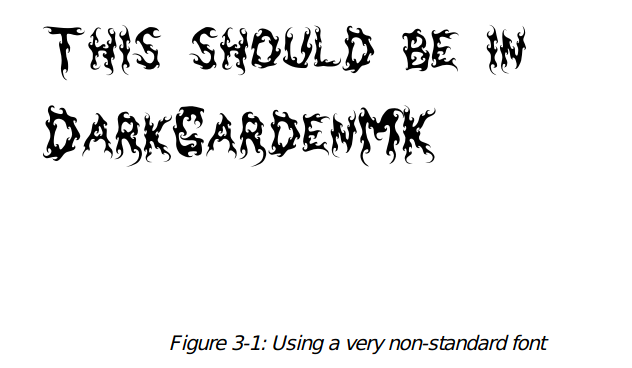
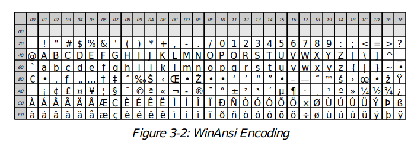
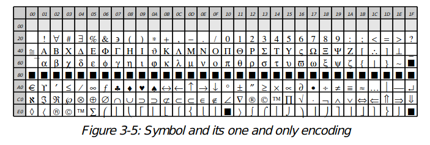
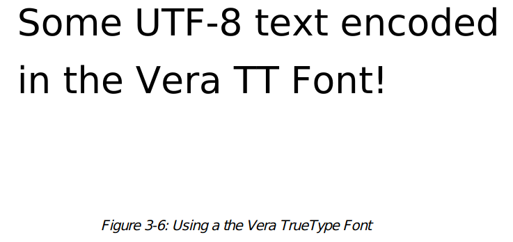

#Fonts and encodings

This chapter covers fonts, encodings and Asian language capabilities.
If you are purely concerned with generating PDFs for Western
European languages, you can just read the "Unicode is the default" section
below and skip the rest on a first reading.
We expect this section to grow considerably over time. We
hope that Open Source will enable us to give better support for
more of the world's languages than other tools, and we welcome
feedback and help in this area.

##Unicode and UTF8 are the default input encodings

Starting with reportlab Version 2.0 (May 2006), all text input you
provide to our APIs should be in UTF8 or as Python Unicode objects.
This applies to arguments to canvas.drawString and related APIs,
table cell content, drawing object parameters, and paragraph source
text.  

We considered making the input encoding configurable or even locale-dependent,
but decided that "explicit is better than implicit".

This simplifies many things we used to do previously regarding greek
letters, symbols and so on.  To display any character, find out its
unicode code point, and make sure the font you are using is able
to display it.

If you are adapting a ReportLab 1.x application, or reading data from
another source which contains single-byte data (e.g. latin-1 or WinAnsi),
you need to do a conversion into Unicode.  The Python codecs package now
includes converters for all the common encodings, including Asian ones.

If your data is not encoded as UTF8, you will get a UnicodeDecodeError as
soon as you feed in a non-ASCII character.  For example, this snippet below is
attempting to read in and print a series of names, including one with a French
accent:  `Marc-Andr\u00e9 Lemburg`.  The standard error is quite helpful and tells you
what character it doesn't like:

	>>> from reportlab.pdfgen.canvas import Canvas
	>>> c = Canvas('temp.pdf')
	>>> y = 700
	>>> for line in file('latin_python_gurus.txt','r'):
	...     c.drawString(100, y, line.strip())
	...
	Traceback (most recent call last):
	...
	UnicodeDecodeError: 'utf8' codec can't decode bytes in position 9-11: invalid data
	-->\u00e9 L<--emburg
	>>> 

The simplest fix is just to convert your data to unicode, saying which encoding
it comes from, like this:

	>>> for line in file('latin_input.txt','r'):
	...     uniLine = unicode(line, 'latin-1')
	...     c.drawString(100, y, uniLine.strip())
	>>>
	>>> c.save()

##Automatic output font substitution

There are still a number of places in the code, including the rl_config
defaultEncoding parameter, and arguments passed to various Font constructors,
which refer to encodings.  These were useful in the past when people needed to
use glyphs in the Symbol and ZapfDingbats fonts which are supported by PDF
viewing devices.

By default the standard fonts (Helvetica, Courier, Times Roman)
will offer the glyphs available in Latin-1.  However, if our engine detects
a character not in the font, it will attempt to switch to Symbol or ZapfDingbats to
display these.   For example, if you include the Unicode character for a pair of 
right-facing scissors, \\u2702, in a call to `drawString`, you should see them (there is
an example in `test_pdfgen_general.py/pdf`).  It is not
necessary to switch fonts in your code.

##Using non-standard Type 1 fonts

As discussed in the previous chapter, every copy of Acrobat Reader
comes with 14 standard fonts built in.  Therefore, the ReportLab
PDF Library only needs to refer to these by name.  If you want
to use other fonts, they must be available to your code and
will be embedded in the PDF document.

You can use the mechanism described below to include arbitrary
fonts in your documents. We have an open source
font named <i>DarkGardenMK</i> which we may
use for testing and/or documenting purposes (and which you may
use as well). It comes bundled with the ReportLab distribution in the
directory $reportlab/fonts$.

Right now font-embedding relies on font description files in the Adobe
AFM ('Adobe Font Metrics') and PFB ('Printer Font Binary') format. The
former is an ASCII file and contains information about the characters
('glyphs') in the font such as height, width, bounding box info and
other 'metrics', while the latter is a binary file that describes the
shapes of the font. The $reportlab/fonts$ directory contains the files
$'DarkGardenMK.afm'$ and $'DarkGardenMK.pfb'$ that are used as an example
font.

In the following example locate the folder containing the test font and
register it for future use with the $pdfmetrics$ module,
after which we can use it like any other standard font.

	import os
	import reportlab
	folder = os.path.dirname(reportlab.__file__) + os.sep + 'fonts'
	afmFile = os.path.join(folder, 'DarkGardenMK.afm')
	pfbFile = os.path.join(folder, 'DarkGardenMK.pfb')

	from reportlab.pdfbase import pdfmetrics
	justFace = pdfmetrics.EmbeddedType1Face(afmFile, pfbFile)
	faceName = 'DarkGardenMK' # pulled from AFM file
	pdfmetrics.registerTypeFace(justFace)
	justFont = pdfmetrics.Font('DarkGardenMK',
							   faceName,
							   'WinAnsiEncoding')
	pdfmetrics.registerFont(justFont)

	canvas.setFont('DarkGardenMK', 32)
	canvas.drawString(10, 150, 'This should be in')
	canvas.drawString(10, 100, 'DarkGardenMK')

<i>Note</i> that the argument "WinAnsiEncoding" has nothing to do with the input;
it's to say which set of characters within the font file will be active
and available.

illust(examples.customfont1, "Using a very non-standard font")

The font's facename comes from the AFM file's $FontName$ field.
In the example above we knew the name in advance, but quite
often the names of font description files are pretty cryptic
and then you might want to retrieve the name from an AFM file
automatically.
When lacking a more sophisticated method you can use some
code as simple as this:

	class FontNameNotFoundError(Exception):
		pass

	def findFontName(path):
		"Extract a font name from an AFM file."

		f = open(path)

		found = 0
		while not found:
			line = f.readline()[:-1]
			if not found and line[:16] == 'StartCharMetrics':
				raise FontNameNotFoundError, path
			if line[:8] == 'FontName':
				fontName = line[9:]
				found = 1

		return fontName

In the <i>DarkGardenMK</i> example we explicitely specified
the place of the font description files to be loaded.
In general, you'll prefer to store your fonts in some canonic
locations and make the embedding mechanism aware of them.
Using the same configuration mechanism we've already seen at the
beginning of this section we can indicate a default search path
for Type-1 fonts.

Unfortunately, there is no reliable standard yet for such
locations (not even on the same platform) and, hence, you might
have to edit one of the files $reportlab_settings.py$ or $~/.reportlab_settings$ to modify the
value of the $T1SearchPath$ identifier to contain additional
directories.  Our own recommendation is to use the `reportlab/fonts`
folder in development; and to have any needed fonts as packaged parts of
your application in any kind of controlled server deployment.  This insulates
you from fonts being installed and uninstalled by other software or system
administrator.

###Warnings about missing glyphs
If you specify an encoding, it is generally assumed that
the font designer has provided all the needed glyphs.  However,
this is not always true.  In the case of our example font,
the letters of the alphabet are present, but many symbols and
accents are missing.  The default behaviour is for the font to
print a 'notdef' character - typically a blob, dot or space -
when passed a character it cannot draw.  However, you can ask
the library to warn you instead; the code below (executed
before loading a font) will cause warnings to be generated
for any glyphs not in the font when you register it.)

	import reportlab.rl_config
	reportlab.rl_config.warnOnMissingFontGlyphs = 0

##Standard Single-Byte Font Encodings

This section shows you the glyphs available in the common encodings.

The code chart below shows the characters in the $WinAnsiEncoding$.
This is the standard encoding on Windows and many Unix systems in America
and Western Europe.  It is also knows as Code Page 1252, and is practically
identical to ISO-Latin-1 (it contains one or two extra characters). This
is the default encoding used by the Reportlab PDF Library. It was generated from
a standard routine in $reportlab/lib$, $codecharts.py$,
which can be used to display the contents of fonts.  The index numbers
along the edges are in hex.

cht1 = SingleByteEncodingChart(encodingName='WinAnsiEncoding',charsPerRow=32, boxSize=12)
illust(lambda canv: cht1.drawOn(canv, 0, 0), "WinAnsi Encoding", cht1.width, cht1.height)

The code chart below shows the characters in the $MacRomanEncoding$.
as it sounds, this is the standard encoding on Macintosh computers in
America and Western Europe.  As usual with non-unicode encodings, the first
128 code points (top 4 rows in this case) are the ASCII standard and agree
with the WinAnsi code chart above; but the bottom 4 rows differ.
cht2 = SingleByteEncodingChart(encodingName='MacRomanEncoding',charsPerRow=32, boxSize=12)
illust(lambda canv: cht2.drawOn(canv, 0, 0), "MacRoman Encoding", cht2.width, cht2.height)

These two encodings are available for the standard fonts (Helvetica,
Times-Roman and Courier and their variants) and will be available for most
commercial fonts including those from Adobe.  However, some fonts contain non-
text glyphs and the concept does not really apply.  For example, ZapfDingbats
and Symbol can each be treated as having their own encoding.

cht3 = SingleByteEncodingChart(faceName='ZapfDingbats',encodingName='ZapfDingbatsEncoding',charsPerRow=32, boxSize=12)
illust(lambda canv: cht3.drawOn(canv, 0, 0), "ZapfDingbats and its one and only encoding", cht3.width, cht3.height)

cht4 = SingleByteEncodingChart(faceName='Symbol',encodingName='SymbolEncoding',charsPerRow=32, boxSize=12)
illust(lambda canv: cht4.drawOn(canv, 0, 0), "Symbol and its one and only encoding", cht4.width, cht4.height)

##TrueType Font Support

Marius Gedminas ($mgedmin@delfi.lt$) with the help of Viktorija Zaksiene ($vika@pov.lt$)
have contributed support for embedded TrueType fonts.  TrueType fonts work in Unicode/UTF8
and are not limited to 256 characters.

We use <b>$reportlab.pdfbase.ttfonts.TTFont$</b> to create a true type
font object and register using <b>$reportlab.pdfbase.pdfmetrics.registerFont$</b>.
In pdfgen drawing directly to the canvas we can do

	# we know some glyphs are missing, suppress warnings
	import reportlab.rl_config
	reportlab.rl_config.warnOnMissingFontGlyphs = 0

	from reportlab.pdfbase import pdfmetrics
	from reportlab.pdfbase.ttfonts import TTFont
	pdfmetrics.registerFont(TTFont('Vera', 'Vera.ttf'))
	pdfmetrics.registerFont(TTFont('VeraBd', 'VeraBd.ttf'))
	pdfmetrics.registerFont(TTFont('VeraIt', 'VeraIt.ttf'))
	pdfmetrics.registerFont(TTFont('VeraBI', 'VeraBI.ttf'))
	canvas.setFont('Vera', 32)
	canvas.drawString(10, 150, "Some text encoded in UTF-8")
	canvas.drawString(10, 100, "In the Vera TT Font!")

illust(examples.ttffont1, "Using a the Vera TrueType Font")

In the above example the true type font object is created using

	TTFont(name,filename)

so that the ReportLab internal name is given by the first argument and the second argument
is a string(or file like object) denoting the font's TTF file. In Marius' original patch the filename
was supposed to be exactly correct, but we have modified things so that if the filename is relative
then a search for the corresponding file is done in the current directory and then in directories
specified by $reportlab.rl_config.TTFSearchpath$!

	from reportlab.lib.styles import ParagraphStyle

	from reportlab.pdfbase.pdfmetrics import registerFontFamily
	registerFontFamily('Vera',normal='Vera',bold='VeraBd',italic='VeraIt',boldItalic='VeraBI')

Before using the TT Fonts in Platypus we should add a mapping from the family name to the
individual font names that describe the behaviour under the $&lt;b&gt;$ and $&lt;i&gt;$ attributes.

	from reportlab.pdfbase.pdfmetrics import registerFontFamily
	registerFontFamily('Vera',normal='Vera',bold='VeraBd',italic='VeraIt',boldItalic='VeraBI')

If we only have a Vera regular font, no bold or italic then we must map all to the
same internal fontname.  `&lt;b&gt;` and `&lt;i&gt;` tags may now be used safely, but
have no effect.
After registering and mapping
the Vera font as above we can use paragraph text like)

	This is in Times-Roman
	and this is in magenta <b>Vera!</b>,"Using TTF fonts in paragraphs"
	

##Asian Font Support
The Reportlab PDF Library aims to expose full support for Asian fonts.
PDF is the first really portable solution for Asian text handling. There are
two main approaches for this:  Adobe's Asian Language Packs, or TrueType fonts.

###Asian Language Packs

This approach offers the best performance since nothing needs embedding in the PDF file;
as with the standard fonts, everything is on the reader.

Adobe makes available add-ons for each main language.  In Adobe Reader 6.0 and 7.0, you
will be prompted to download and install these as soon as you try to open a document
using them.  In earlier versions, you would see an error message on opening an Asian document
and had to know what to do.   

Japanese, Traditional Chinese (Taiwan/Hong Kong), Simplified Chinese (mainland China)
and Korean are all supported and our software knows about the following fonts:
 
	$chs$ = Chinese Simplified (mainland): '$STSong-Light$'
	$cht$ = Chinese Traditional (Taiwan): '$MSung-Light$', '$MHei-Medium$'
	$kor$ = Korean: '$HYSMyeongJoStd-Medium$','$HYGothic-Medium$'
	$jpn$ = Japanese: '$HeiseiMin-W3$', '$HeiseiKakuGo-W5$'

Since many users will not have the font packs installed, we have included
a rather grainy `bitmap` of some Japanese characters.  We will discuss below what is needed to
generate them.

	# include a bitmap of some Asian text
	I=os.path.join(os.path.dirname(reportlab.__file__),'docs','images','jpnchars.jpg')
	try:
		getStory().append(Image(I))
	except:
		disc(An image should have appeared here.)

Prior to Version 2.0, you had to specify one of many native encodings
when registering a CID Font. In version 2.0 you should a new UnicodeCIDFont
class.

	from reportlab.pdfbase import pdfmetrics
	from reportlab.pdfbase.cidfonts import UnicodeCIDFont
	pdfmetrics.registerFont(UnicodeCIDFont('HeiseiMin-W3'))
	canvas.setFont('HeiseiMin-W3', 16)

	# the two unicode characters below are "Tokyo"
	msg = u'\\u6771\\u4EAC : Unicode font, unicode input'
	canvas.drawString(100, 675, msg)
 

The old coding style with explicit encodings should still work, but is now
only relevant if you need to construct vertical text.  We aim to add more readable options
for horizontal and vertical text to the UnicodeCIDFont constructor in future.
The following four test scripts generate samples in the corresponding languages:
	tests/test_multibyte_jpn.py
	tests/test_multibyte_kor.py
	tests/test_multibyte_chs.py
	tests/test_multibyte_cht.py)

In previous versions of the ReportLab PDF Library, we had to make
use of Adobe's CMap files (located near Acrobat Reader if the Asian Language
packs were installed).  Now that we only have one encoding to deal with, the
character width data is embedded in the package, and CMap files are not needed
for generation.  The CMap search path in `rl_config.py` is now deprecated
and has no effect if you restrict yourself to UnicodeCIDFont.

###TrueType fonts with Asian characters

This is the easy way to do it.  No special handling at all is needed to
work with Asian TrueType fonts.  Windows users who have installed, for example,
Japanese as an option in Control Panel, will have a font "msmincho.ttf" which
can be used.  However, be aware that it takes time to parse the fonts, and that
quite large subsets may need to be embedded in your PDFs.  We can also now parse
files ending in .ttc, which are a slight variation of .ttf.

###To Do

We expect to be developing this area of the package for some time.accept2dyear
Here is an outline of the main priorities.  We welcome help!

Ensure that we have accurate character metrics for all encodings in horizontal and
vertical writing.

Add options to `UnicodeCIDFont` to allow vertical and proportional variants where the font permits it.

Improve the word wrapping code in paragraphs and allow vertical writing.

##RenderPM tests

This may also be the best place to mention the test function of $reportlab/graphics/renderPM.py$,
which can be considered the cannonical place for tests which exercise renderPM (the "PixMap Renderer",
as opposed to renderPDF, renderPS or renderSVG).

If you run this from the command line, you should see lots of output like the following.

	eg(C:\\code\\reportlab\\graphics>renderPM.py
	wrote pmout\\renderPM0.gif
	wrote pmout\\renderPM0.tif
	wrote pmout\\renderPM0.png
	wrote pmout\\renderPM0.jpg
	wrote pmout\\renderPM0.pct
	...
	wrote pmout\\renderPM12.gif
	wrote pmout\\renderPM12.tif
	wrote pmout\\renderPM12.png
	wrote pmout\\renderPM12.jpg
	wrote pmout\\renderPM12.pct
	wrote pmout\\index.html)

This runs a number of tests progressing from a "Hello World" test, through various tests of
Lines; text strings in a number of sizes, fonts, colours and alignments; the basic shapes; translated
and rotated groups; scaled coordinates; rotated strings; nested groups; anchoring and non-standard fonts.

It creates a subdirectory called $pmout$, writes the image files into it, and writes an
$index.html$ page which makes it easy to refer to all the results.

The font-related tests which you may wish to look at are test #11 ('Text strings in a non-standard font')
and test #12 ('Test Various Fonts').
