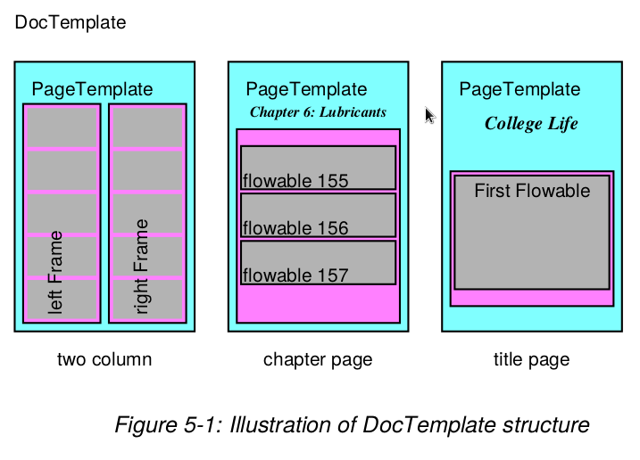

#PLATYPUS - Page Layout and Typography Using Scripts

##Design Goals


Platypus stands for &quot;Page Layout and Typography Using Scripts&quot;.  It is a high
level page layout library which lets you programmatically create complex
documents with a minimum of effort.

The design of Platypus seeks to separate "high level" layout decisions
from the document content as much as possible.  Thus, for example, paragraphs
are constructed using paragraph styles and pages are constructed
using page templates with the intention that hundreds of
documents with thousands of pages can be reformatted to different
style specifications with the modifications of a few lines in a single
shared file which contains the paragraph styles and page layout specifications.

The overall design of Platypus can be thought of has having
several layers, top down, these are

<b>`DocTemplates`</b> the outermost container for the document;

<b>`PageTemplates`</b> specifications for layouts of pages of various kinds;

<b>`Frames`</b> specifications of regions in pages that can contain flowing text or graphics.

<b>`Flowables`</b> text or graphic elements that should be "flowed
   into the document (i.e. things like images, paragraphs and tables, but not things
   like page footers or fixed page graphics).

<b>`pdfgen.Canvas`</b> the lowest level which ultimately receives the painting of the
   document from the other layers.




 The illustration above graphically illustrates the concepts of `DocTemplates`,
 `PageTemplates` and `Flowables`.  It is deceptive, however, because each
 of the `PageTemplates` actually may specify the format for any number of pages
 (not just one as might be inferred from the diagram).


`DocTemplates` contain one or more `PageTemplates` each of which contain one or more
Frames. `Flowables` are things which can be <i>flowed</i> into a `Frame` e.g.
a `Paragraph` or a `Table`.


To use platypus you create a document from a `DocTemplate` class and pass
a list of `Flowable`s to its `build` method. The document
`build` method knows how to process the list of flowables
into something reasonable.


Internally the `DocTemplate` class implements page layout and formatting
using various events. Each of the events has a corresponding handler method
called `handle_XXX` where `XXX` is the event name. A typical event is
`frameBegin` which occurs when the machinery begins to use a frame for the
first time.


A Platypus story consists of a sequence of basic elements called `Flowables`
and these elements drive the data driven Platypus formatting engine.
To modify the behavior of the engine
a special kind of flowable, `ActionFlowables`, tell the layout engine to,
for example, skip to the next
column or change to another `PageTemplate`.


##Getting started

Consider the following code sequence which provides
a very simple "hello world" example for Platypus.

examples.platypussetup

First we import some constructors, some paragraph styles
and other conveniences from other modules.

(examples.platypusfirstpage)

We define the fixed features of the first page of the document
with the function above.

(examples.platypusnextpage)

Since we want pages after the first to look different from the
first we define an alternate layout for the fixed features
of the other pages.  Note that the two functions above use
the `pdfgen` level canvas operations to paint the annotations for
the pages.


(examples.platypusgo)


Finally, we create a story and build the document.
Note that we are using a "canned" document template here which
comes pre-built with page templates.  We are also using a pre-built
paragraph style.  We are only using two types of flowables here
-- `Spacers` and `Paragraphs`.  The first `Spacer` ensures that the
Paragraphs skip past the title string.


To see the output of this example program run the module
`docs/userguide/examples.py` (from the ReportLab `docs` distribution)
as a "top level script".  The script interpretation `python examples.py` will
generate the Platypus output `phello.pdf`.


##Flowables

`Flowables` are things which can be drawn and which have `wrap`, `draw` and perhaps `split` methods.
`Flowable` is an abstract base class for things to be drawn and an instance knows its size
and draws in its own coordinate system (this requires the base API to provide an absolute coordinate
system when the `Flowable.draw` method is called). To get an instance use `f=Flowable()`.


It should be noted that the `Flowable` class is an <i>abstract</i> class and is normally
only used as a base class.

`k=startKeep()`

To illustrate the general way in which `Flowables` are used we show how a derived class `Paragraph`
is used and drawn on a canvas. `Paragraphs` are so important they will get a whole chapter
to themselves.

``` python
    from reportlab.lib.styles import getSampleStyleSheet
    from reportlab.platypus import Paragraph
    from reportlab.pdfgen.canvas import Canvas
    styleSheet = getSampleStyleSheet()
    style = styleSheet['BodyText']
    P=Paragraph('This is a very silly example',style)
    canv = Canvas('doc.pdf')
    aW = 460    # available width and height
    aH = 800
    w,h = P.wrap(aW, aH)    # find required space
    if w<=aW and h<=aH:
        P.drawOn(canv,0,aH)
        aH = aH - h         # reduce the available height
        canv.save()
    else:
        raise ValueError, "Not enough room"
```
`endKeep(k)`
###Flowable User Methods
```
    Flowable.draw()
```
This will be called to ask the flowable to actually render itself.
The `Flowable` class does not implement `draw`.
The calling code should ensure that the flowable has an attribute `canv`
which is the `pdfgen.Canvas` which should be drawn to an that the `Canvas`
is in an appropriate state (as regards translations rotations, etc). Normally
this method will only be called internally by the `drawOn` method. Derived classes
must implement this method.

```
    Flowable.drawOn(canvas,x,y)
```

This is the method which controlling programs use to render the flowable to a particular
canvas. It handles the translation to the canvas coordinate (<i>x</i>,<i>y</i>) and ensuring that
the flowable has a `canv` attribute so that the
`draw` method (which is not implemented in the base class) can render in an
absolute coordinate frame.

```
    Flowable.wrap(availWidth, availHeight)
```
This will be called by the enclosing frame before objects
are asked their size, drawn or whatever.  It returns the
size actually used.
```
    Flowable.split(self, availWidth, availheight):
```
This will be called by more sophisticated frames when
        wrap fails. Stupid flowables should return [] meaning that they are unable to split.
Clever flowables should split themselves and return a list of flowables. It is up to
the client code to ensure that repeated attempts to split are avoided.
If the space is sufficient the split method should return [self].
Otherwise
the flowable should rearrange itself and return a list `[f0,...]` of flowables
which will be considered in order. The implemented split method should avoid
changing `self` as this will allow sophisticated layout mechanisms to do multiple
passes over a list of flowables.


##Guidelines for flowable positioning

Two methods, which by default return zero, provide guidance on vertical
spacing of flowables:


```
    Flowable.getSpaceAfter(self):
    Flowable.getSpaceBefore(self):
```
These methods return how much space should follow or precede
the flowable. The space doesn't belong to the flowable itself i.e. the flowable's
`draw` method shouldn't consider it when rendering. Controlling programs
will use the values returned in determining how much space is required by
a particular flowable in context.


All flowables have an `hAlign` property: `('LEFT', 'RIGHT', 'CENTER' or 'CENTRE')`.
For paragraphs, which fill the full width of the frame, this has no effect.  For tables,
images or other objects which are less than the width of the frame, this determines their
horizontal placement.


The chapters which follow will cover the most important
specific types of flowables: Paragraphs and Tables.


##Frames

Frames are active containers which are themselves contained in `PageTemplates`.
Frames have a location and size and maintain a concept of remaining drawable
space. The command


```
    Frame(x1, y1, width,height, leftPadding=6, bottomPadding=6,
            rightPadding=6, topPadding=6, id=None, showBoundary=0)
```
creates a `Frame` instance with lower left hand corner at coordinate `(x1,y1)`
(relative to the canvas at use time) and with dimensions `width` x `height`. The `Padding`
arguments are positive quantities used to reduce the space available for drawing.
The `id` argument is an identifier for use at runtime e.g. 'LeftColumn' or 'RightColumn' etc.
If the `showBoundary` argument is non-zero then the boundary of the frame will get drawn
at run time (this is useful sometimes).

###Frame User Methods
```
    Frame.addFromList(drawlist, canvas)
```
consumes `Flowables` from the front of `drawlist` until the
    frame is full.  If it cannot fit one object, raises
    an exception.

```
    Frame.split(flowable,canv)
```
'''Asks the flowable to split using up the available space and return
the list of flowables.
'''

```
    Frame.drawBoundary(canvas)
```
"draws the frame boundary as a rectangle (primarily for debugging)."

###Using Frames

Frames can be used directly with canvases and flowables to create documents.
The `Frame.addFromList` method handles the `wrap` &amp; `drawOn` calls for you.
You don't need all of the Platypus machinery to get something useful into
PDF.

``` python
from reportlab.pdfgen.canvas import Canvas
from reportlab.lib.styles import getSampleStyleSheet
from reportlab.lib.units import inch
from reportlab.platypus import Paragraph, Frame
styles = getSampleStyleSheet()
styleN = styles['Normal']
styleH = styles['Heading1']
story = []

#add some flowables
story.append(Paragraph("This is a Heading",styleH))
story.append(Paragraph("This is a paragraph in <i>Normal</i> style.",
    styleN))
c  = Canvas('mydoc.pdf')
f = Frame(inch, inch, 6*inch, 9*inch, showBoundary=1)
f.addFromList(story,c)
c.save()
```

##Documents and Templates


The `BaseDocTemplate` class implements the basic machinery for document
formatting. An instance of the class contains a list of one or more
`PageTemplates` that can be used to describe the layout of information
on a single page. The `build` method can be used to process
a list of `Flowables` to produce a <b>PDF</b> document.


CPage(3.0)
###The `BaseDocTemplate` class

```
    BaseDocTemplate(self, filename,
                    pagesize=defaultPageSize,
                    pageTemplates=[],
                    showBoundary=0,
                    leftMargin=inch,
                    rightMargin=inch,
                    topMargin=inch,
                    bottomMargin=inch,
                    allowSplitting=1,
                    title=None,
                    author=None,
                    _pageBreakQuick=1,
                    encrypt=None)
```


creates a document template suitable for creating a basic document. It comes with quite a lot
of internal machinery, but no default page templates. The required `filename` can be a string,
the name of a file to  receive the created <b>PDF</b> document; alternatively it
can be an object which has a `write` method such as a `BytesIO` or `file` or `socket`.


The allowed arguments should be self explanatory, but `showBoundary` controls whether or
not `Frame` boundaries are drawn which can be useful for debugging purposes. The
`allowSplitting` argument determines whether the builtin methods should try to <i>split</i>
individual `Flowables` across Frames. The `_pageBreakQuick` argument determines whether
an attempt to do a page break should try to end all the frames on the page or not, before ending
the page. The encrypt argument determines wether or not and how the document is encrypted.
By default, the document is not encrypted.
If `encrypt` is a string object, it is used as the user password for the pdf.
If `encrypt` is an instance of `reportlab.lib.pdfencrypt.StandardEncryption`, this object is
used to encrypt the pdf. This allows more finegrained control over the encryption settings.


####User `BaseDocTemplate` Methods

These are of direct interest to client programmers
in that they are normally expected to be used.

```
    BaseDocTemplate.addPageTemplates(self,pageTemplates)
```

This method is used to add one or a list of `PageTemplates` to an existing documents.

```
    BaseDocTemplate.build(self, flowables, filename=None, canvasmaker=canvas.Canvas)
```

This is the main method which is of interest to the application
programmer. Assuming that the document instance is correctly set up the
`build` method takes the <i>story</i> in the shape of the list of flowables
(the `flowables` argument) and loops through the list forcing the flowables
one at a time through the formatting machinery. Effectively this causes
the `BaseDocTemplate` instance to issue calls to the instance `handle_XXX` methods
to process the various events.

####User Virtual `BaseDocTemplate` Methods

These have no semantics at all in the base class. They are intended as pure virtual hooks
into the layout machinery. Creators of immediately derived classes can override these
without worrying about affecting the properties of the layout engine.

```
    BaseDocTemplate.afterInit(self)
```

This is called after initialisation of the base class; a derived class could overide
the method to add default `PageTemplates`.


```
    BaseDocTemplate.afterPage(self)
```
This is called after page processing, and
        immediately after the afterDrawPage method
        of the current page template. A derived class could
use this to do things which are dependent on information in the page
such as the first and last word on the page of a dictionary.


```
    BaseDocTemplate.beforeDocument(self)
```

This is called before any processing is
done on the document, but after the processing machinery
is ready. It can therefore be used to do things to the instance\'s
`pdfgen.canvas` and the like.


```
    BaseDocTemplate.beforePage(self)
```

This is called at the beginning of page
        processing, and immediately before the
        beforeDrawPage method of the current page
        template. It could be used to reset page specific
        information holders.

```
    BaseDocTemplate.filterFlowables(self,flowables)
```

This is called to filter flowables at the start of the main handle_flowable method.
        Upon return if flowables[0] has been set to None it is discarded and the main
        method returns immediately.
        

```
    BaseDocTemplate.afterFlowable(self, flowable)
```

Called after a flowable has been rendered. An interested class could use this
hook to gather information about what information is present on a particular page or frame.

####`BaseDocTemplate` Event handler Methods

These methods constitute the greater part of the layout engine. Programmers shouldn't
have to call or override these methods directly unless they are trying to modify the layout engine.
Of course, the experienced programmer who wants to intervene at a particular event, `XXX`,
which does not correspond to one of the virtual methods can always override and
call the base method from the drived class version. We make this easy by providing
a base class synonym for each of the handler methods with the same name prefixed by an underscore '_'.


``` python
    def handle_pageBegin(self):
        doStuff()
        BaseDocTemplate.handle_pageBegin(self)
        doMoreStuff()

    #using the synonym
    def handle_pageEnd(self):
        doStuff()
        self._handle_pageEnd()
        doMoreStuff()
```

Here we list the methods only as an indication of the events that are being
handled.

Interested programmers can take a look at the source.

``` python
    handle_currentFrame(self,fx)
    handle_documentBegin(self)
    handle_flowable(self,flowables)
    handle_frameBegin(self,*args)
    handle_frameEnd(self)
    handle_nextFrame(self,fx)
    handle_nextPageTemplate(self,pt)
    handle_pageBegin(self)
    handle_pageBreak(self)
    handle_pageEnd(self)
```


Using document templates can be very easy; `SimpleDoctemplate` is a class derived from
`BaseDocTemplate` which provides its own `PageTemplate` and `Frame` setup.


``` python
from reportlab.lib.styles import getSampleStyleSheet
from reportlab.lib.pagesizes import letter
from reportlab.platypus import Paragraph, SimpleDocTemplate
styles = getSampleStyleSheet()
styleN = styles['Normal']
styleH = styles['Heading1']
story = []

#add some flowables
story.append(Paragraph("This is a Heading",styleH))
story.append(Paragraph("This is a paragraph in <i>Normal</i> style.",
    styleN))
doc = SimpleDocTemplate('mydoc.pdf',pagesize = letter)
doc.build(story)
```

###PageTemplates

The `PageTemplate` class is a container class with fairly minimal semantics. Each instance
contains a list of Frames and has methods which should be called at the start and end
of each page.

`PageTemplate(id=None,frames=[],onPage=_doNothing,onPageEnd=_doNothing)`

is used to initialize an instance, the Frames argument should be a list of Frames
whilst the optional `onPage` and `onPageEnd` arguments are callables which should have signature
`def XXX(canvas,document)` where `canvas` and `document`
are the canvas and document being drawn. These routines are intended to be used to paint non-flowing (i.e. standard)
parts of pages. These attribute functions are exactly parallel to the pure virtual methods
`PageTemplate.beforPage` and `PageTemplate.afterPage` which have signature
`beforPage(self,canvas,document)`. The methods allow class derivation to be used to define
standard behaviour, whilst the attributes allow instance changes. The `id` argument is used at
run time to perform `PageTemplate` switching so `id='FirstPage'` or `id='TwoColumns'` are typical.
