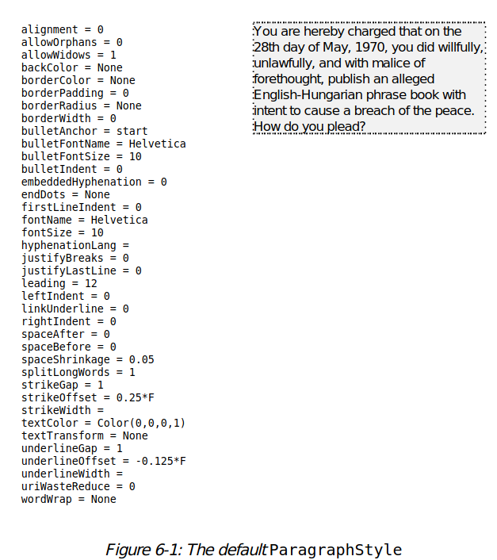
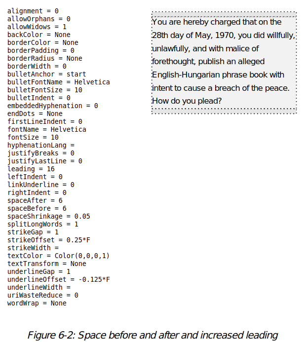
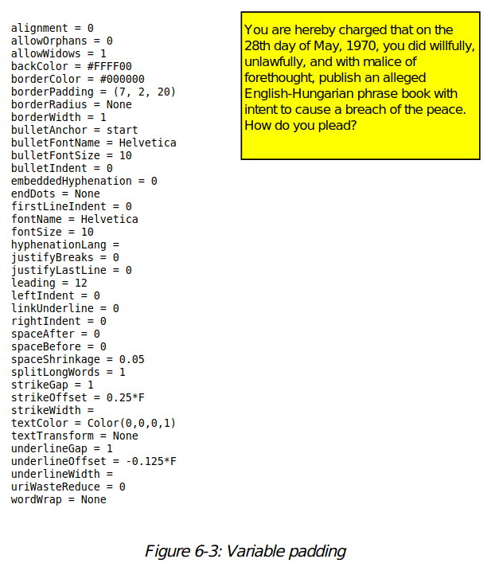
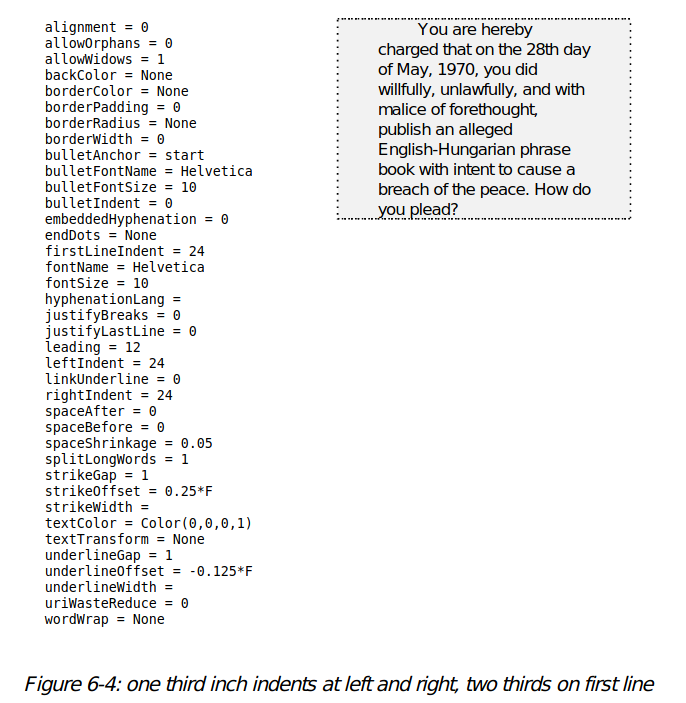
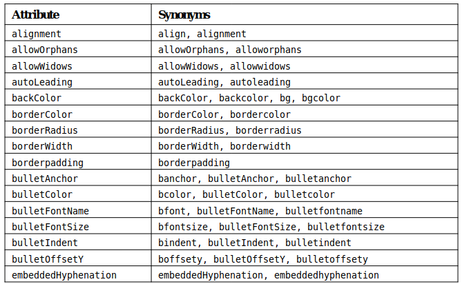
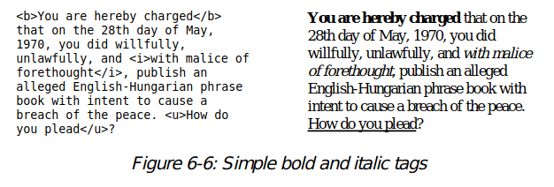
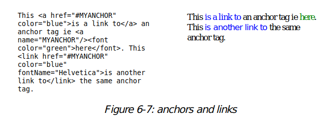
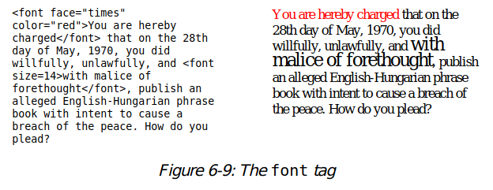
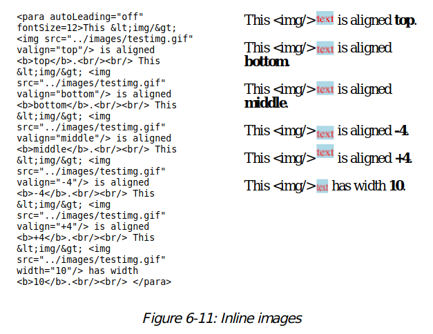

#Paragraphs

The `reportlab.platypus.Paragraph` class is one of the most useful of the Platypus `Flowables`;
it can format fairly arbitrary text and provides for inline font style and colour changes using
an XML style markup. The overall shape of the formatted text can be justified, right or left ragged
or centered. The XML markup can even be used to insert greek characters or to do subscripts.

The following text creates an instance of the `Paragraph` class:
```Paragraph(text, style, bulletText=None)```
The `text` argument contains the text of the
paragraph; excess white space is removed from the text at the ends and internally after
linefeeds. 

This allows easy use of indented triple quoted text in <b>`Python`</b> scripts.
The `bulletText` argument provides the text of a default bullet for the paragraph.
The font and other properties for the paragraph text and bullet are set using the style argument.


The `style` argument should be an instance of class `ParagraphStyle` obtained typically
using
```
from reportlab.lib.styles import ParagraphStyle
```

This container class provides for the setting of multiple default paragraph attributes
in a structured way. The styles are arranged in a dictionary style object called a `stylesheet`
which allows for the styles to be accessed as `stylesheet['BodyText']`. A sample style
sheet is provided.

```
from reportlab.lib.styles import getSampleStyleSheet
stylesheet=getSampleStyleSheet()
normalStyle = stylesheet['Normal']
```

The options which can be set for a `Paragraph` can be seen from the `ParagraphStyle` defaults. The values with leading underscore ('_') are derived from the defaults in module `reportlab.rl_config` which are derived from
module `reportlab.rl_settings`.

####`class ParagraphStyle`
```
class ParagraphStyle(PropertySet):
    defaults = {
        'fontName':_baseFontName,
        'fontSize':10,
        'leading':12,
        'leftIndent':0,
        'rightIndent':0,
        'firstLineIndent':0,
        'alignment':TA_LEFT,
        'spaceBefore':0,
        'spaceAfter':0,
        'bulletFontName':_baseFontName,
        'bulletFontSize':10,
        'bulletIndent':0,
        'textColor': black,
        'backColor':None,
        'wordWrap':None,
        'borderWidth': 0,
        'borderPadding': 0,
        'borderColor': None,
        'borderRadius': None,
        'allowWidows': 1,
        'allowOrphans': 0,
        'textTransform':None,
        'endDots':None,
        'splitLongWords':1,
        'underlineWidth': _baseUnderlineWidth,
        'bulletAnchor': 'start',
        'justifyLastLine': 0,
        'justifyBreaks': 0,
        'spaceShrinkage': _spaceShrinkage,
        'strikeWidth': _baseStrikeWidth,    #stroke width
        'underlineOffset': _baseUnderlineOffset,    #fraction of fontsize to offset underlines
        'underlineGap': _baseUnderlineGap,      #gap for double/triple underline
        'strikeOffset': _baseStrikeOffset,  #fraction of fontsize to offset strikethrough
        'strikeGap': _baseStrikeGap,        #gap for double/triple strike
        'linkUnderline': _platypus_link_underline,
        #'underlineColor':  None,
        #'strikeColor': None,
        'hyphenationLang': _hyphenationLang,
        'uriWasteReduce': _uriWasteReduce,
        'embeddedHyphenation': _embeddedHyphenation,
        }
```

##Using Paragraph Styles

this will be used in the ParaBox demos.
sample = """You are hereby charged that on the 28th day of May, 1970, you did
willfully, unlawfully, and with malice of forethought, publish an
alleged English-Hungarian phrase book with intent to cause a breach
of the peace.  How do you plead?"""


The `Paragraph` and `ParagraphStyle` classes together
handle most common formatting needs. The following examples
draw paragraphs in various styles, and add a bounding box
so that you can see exactly what space is taken up.
```
s1 = ParagraphStyle('Normal')
parabox(sample, s1, 'The default `ParagraphStyle`')
```


The two attributes `spaceBefore` and `spaceAfter` do what they
say, except at the top or bottom of a frame. At the top of a frame,
`spaceBefore` is ignored, and at the bottom, `spaceAfter` is ignored.
This means that you could specify that a 'Heading2' style had two
inches of space before when it occurs in mid-page, but will not
get acres of whitespace at the top of a page.  These two attributes
should be thought of as 'requests' to the Frame and are not part
of the space occupied by the Paragraph itself.

The `fontSize` and `fontName` tags are obvious, but it is
important to set the `leading`.  This is the spacing between
adjacent lines of text; a good rule of thumb is to make this
20% larger than the point size.  To get double-spaced text,
use a high `leading`. 

If you set `autoLeading(default "off")` to `min`(use observed leading even if smaller than specified) or `max`(use the larger of observed and specified) then an attempt is made to determine the leading
on a line by line basis. This may be useful if the lines contain different font sizes etc.

The figure below shows space before and after and an
increased leading:

```
parabox(sample,
        ParagraphStyle('Spaced',
                       spaceBefore=6,
                       spaceAfter=6,
                       leading=16),
        'Space before and after and increased leading'
        )
```



The attribute `borderPadding` adjusts the padding between the paragraph and the border of its background.
This can either be a single value or a tuple containing 2 to 4 values.
These values are applied the same way as in Cascading Style Sheets (CSS).
If a single value is given, that value is applied to all four sides.
If more than one value is given, they are applied in clockwise order to the sides starting at the top.
If two or three values are given, the missing values are taken from the opposite side(s).
Note that in the following example the yellow box is drawn by the paragraph itself.

```
parabox(sample,
        ParagraphStyle('padded',
                       borderPadding=(7, 2, 20),
                       borderColor='#000000',
                       borderWidth=1,
                       backColor='#FFFF00'),
        'Variable padding'
        )
```


The `leftIndent` and `rightIndent` attributes do exactly
what you would expect; `firstLineIndent` is added to the `leftIndent` of the
first line. If you want a straight left edge, remember
to set `firstLineIndent` equal to 0.
```
parabox(sample,
        ParagraphStyle('indented',
                       firstLineIndent=+24,
                       leftIndent=24,
                       rightIndent=24),
        'one third inch indents at left and right, two thirds on first line'
        )
```


Setting `firstLineIndent` equal to a negative number, `leftIndent`
much higher, and using a
different font (we'll show you how later!) can give you a
definition list:.

```
parabox('<b><i>Judge Pickles: </i></b>' + sample,
        ParagraphStyle('dl',
                       leftIndent=36),
        'Definition Lists'
        )
```


There are four possible values of `alignment`, defined as
constants in the module <i>`reportlab.lib.enums`</i>.  These are
`TA_LEFT`, `TA_CENTER` or `TA_CENTRE`, `TA_RIGHT` and
`TA_JUSTIFY`, with values of `0, 1, 2 and 4` respectively.  These
do exactly what you would expect.

Set `wordWrap` to `CJK` to get Asian language linewrapping. For normal western text you can change the way
the line breaking algorithm handles <i>`widows`</i> and <i>`orphans`</i> with the `allowWidows` and `allowOrphans` values.
Both should normally be set to `0`, but for historical reasons we have allowed <i>`widows`</i>.
The default color of the text can be set with `textColor` and the paragraph background
colour can be set with `backColor`. The paragraph's border properties may be changed using
`borderWidth`, `borderPadding`, `borderColor` and `borderRadius`.

The `textTransform` attribute can be <b><i>`None`</i></b>, <i>`uppercase`</i> or <i>`lowercase`</i> to get the obvious result and <i>`capitalize`</i> to get initial letter capitalization.

Attribute `endDots` can be <b><i>`None`</i></b>, a `string`, or an object with attributes `text` and optional `fontName`, `fontSize`, `textColor`,  `backColor`
and `dy(y offset)` to specify trailing matter on the last line of left/right justified paragraphs.

The `splitLongWords` attribute can be set to a `false` value to avoid splitting very long words.

Attribute `bulletAnchor` can be <i>`start`</i>, <i>`middle`</i>, <i>`end`</i> or <i>`numeric`</i> to control where the bullet is anchored.

The `justifyBreaks` attribute controls whether lines deliberately broken with a `&lt;br/&gt;` tag should be justified

Attribute `spaceShrinkage` is a fractional number specifiying by how much the space of a paragraph
line may be shrunk in order to make it fit; typically it is something like `0.05`

The `underlineWidth`, `underlineOffset`, `underlineGap` &amp; `underlineColor` attributes control the underline behaviour when the `&lt;u&gt;` or
a linking tag is used. Those tags can have override values of these attributes. The attribute value  for `width` &amp; `offset`
is a `fraction * Letter` where letter can be one of `P`, `L`, `f` or `F` representing fontSize proportions. `P` uses the fontsize at the tag, `F` is the maximum fontSize in the tag, `f` is the initial fontsize inside the tag.
`L` means the global (paragrpah style) font size.
`strikeWidth`, `strikeOffset`, `strikeGap` &amp; `strikeColor` attributes do the same for strikethrough lines.

Attribute `linkUnderline` controls whether link tags are automatically underlined. 

If the `pyphen` python module is installed attribute `hyphenationLang` controls which language will be used to hyphenate words without explicit embedded hyphens.
If `embeddedHyphenation` is set then attempts will be made to split words with embedded hyphens.

Attribute `uriWasteReduce` controls how we attempt to split long uri's. It is the fraction of a line that we regard as too much waste. The default in module
`reportlab.rl_settings` is <i>`0.5`</i> which means that we will try and split a word that looks like a uri if we would waste at least half of the line.
Currently the hyphenation and uri splitting are turned off by default. You need to modify the default settings by using the file `~/.rl_settings` or adding a module `reportlab_settings.py` to the python path. Suitable values are

```
    hyphenationLanguage='en_GB'
    embeddedHyphenation=1
    uriWasteReduce=0.3
```


##Paragraph XML Markup Tags
XML markup can be used to modify or specify the
overall paragraph style, and also to specify intra-
paragraph markup.

###The outermost &lt; para &gt; tag

The paragraph text may optionally be surrounded by
&lt;para attributes....&gt;
&lt;/para&gt;
tags. The attributes if any of the opening &lt;para&gt; tag affect the style that is used
with the `Paragraph` `text` and/or `bulletText`.

```
from reportlab.platypus.paraparser import _addAttributeNames, _paraAttrMap, _bulletAttrMap

def getAttrs(A):
    _addAttributeNames(A)
    S={}
    for k, v in A.items():
        a = v[0]
        if a not in S:
            S[a] = [k]
        else:
            S[a].append(k)

    K = list(sorted(S.keys()))
    K.sort()
    D=[('Attribute','Synonyms')]
    for k in K:
        D.append((k,", ".join(list(sorted(S[k])))))
    cols=2*[None]
    rows=len(D)*[None]
    return D,cols,rows

t=Table(*getAttrs(_paraAttrMap))
t.setStyle(TableStyle([
            ('FONT',(0,0),(-1,1),'Times-Bold',10,12),
            ('FONT',(0,1),(-1,-1),'Courier',8,8),
            ('VALIGN',(0,0),(-1,-1),'MIDDLE'),
            ('INNERGRID', (0,0), (-1,-1), 0.25, colors.black),
            ('BOX', (0,0), (-1,-1), 0.25, colors.black),
            ]))
getStory().append(t)
```
Table `<seq template="%(Chapter)s-%(Table+)s"/>` - Synonyms for style attributes



Some useful synonyms have been provided for our Python attribute
names, including lowercase versions, and the equivalent properties
from the HTML standard where they exist.  These additions make
it much easier to build XML-printing applications, since
much intra-paragraph markup may not need translating. The
table below shows the allowed attributes and synonyms in the
outermost paragraph tag.

CPage(1)
##Intra-paragraph markup
Within each paragraph, we use a basic set of XML tags
to provide markup.  The most basic of these are `bold` (`<b>...</b>`),
`italic` (`<i>...</i>`) and `underline` (`<u>...</u>`).

Other tags which are allowed are `strong` (`<strong>...</strong>`), and `strike` through (`<strike>...</strike>`). The `<link>` and `<a>` tags
may be used to refer to URIs, documents or bookmarks in the current document. The a variant of the `<a>` tag can be used to
mark a position in a document.
A `break` (`<br/>`) tag is also allowed.

```
<b>You are hereby charged</b> that on the 28th day of May, 1970, you did
willfully, unlawfully, and <i>with malice of forethought</i>, publish an
alleged English-Hungarian phrase book with intent to cause a breach
of the peace.  <u>How do you plead</u>?,\ "Simple bold and italic tags"
```



This `<a href="#MYANCHOR" color="blue">is a link to</a>` an anchor tag ie `<a name="MYANCHOR"/><font color="green">here</font>`.
This `<link href="#MYANCHOR" color="blue" fontName="Helvetica">is another link to</link>` the same anchor tag.,"anchors and links"



The `<b>link</b>` tag can be used as a reference, but
not as an anchor. The `a` and `link` hyperlink tags have additional attributes `<i>fontName</i>`,
`<i>fontSize</i>`, `<i>color</i>` &amp; `<i>backColor</i>` attributes.
The hyperlink reference can have a scheme of `<b>http:</b><i>(external webpage)</i>`, `<b>pdf:</b><i>(different pdf document)</i>` or 
<b>`document`:</b><i>`(same pdf document)`</i>; a missing scheme is treated as <b>`document`</b> as is the case when the reference starts with `#` (in which case the anchor should omit it). Any other scheme is treated as some kind of URI.


```
`<strong>You are hereby charged</strong>` that on the 28th day of May, 1970, you did
willfully, unlawfully, `<strike>`and with malice of forethought`</strike>`, `<br/>`publish an
alleged English-Hungarian phrase book with intent to cause a breach
of the peace. How do you plead?, "Strong, strike, and break tags"
```


###The &lt;font&gt; tag
The &lt;`font`&gt; tag can be used to change the font name,
size and text color for any substring within the paragraph.
Legal attributes are `size`, `face`, `name` (which is the same as `face`),
`color`, and `fg` (which is the same as `color`). The `name` is
the font family name, without any 'bold' or 'italic' suffixes.
Colors may be
HTML color names or a hex string encoded in a variety of ways;
see `reportlab.lib.colors` for the formats allowed.

`<font face="times" color="red">`You are hereby charged</font> that on the 28th day of May, 1970, you did
willfully, unlawfully, and `<font size=14>`with malice of forethought`</font>`,
publish an
alleged English-Hungarian phrase book with intent to cause a breach
of the peace.  How do you plead?.



###Superscripts and Subscripts
Superscripts and subscripts are supported with the
`<super>`/`<sup>` and `<sub>` tags, which work exactly
as you might expect. Additionally these three tags have
attributes `rise` and `size` to optionally set the rise/descent
and `font size` for the  `superscript`/`subscript` text.
In addition, most greek letters
can be accessed by using the `<greek></greek>`
tag, or with `mathML` entity names.

```
<greek>epsilon</greek><super><greek>iota</greek>
<greek>pi</greek></super> = -1,
```
```
(Equation (&alpha;): <greek>e</greek> <super rise=9 size=6><greek>ip</greek></super>  = -1,
```


###Inline Images
We can embed images in a paragraph with the 
&lt;`img`/&gt; tag which has attributes `src`, `width`, `height` whose meanings are obvious. The `valign` attribute may be set to a css like value from
`baseline`, `sub`, `super`, `top`, `text-top`, `middle`, `bottom`, `text-bottom`; the value may also be a numeric percentage or an absolute value.

<para autoLeading="off" fontSize=12>This &lt;img/&gt; `` is aligned <b>top</b>.<br/>
This &lt;img/&gt; `` is aligned <b>bottom</b>.<br/>
This &lt;img/&gt; `` is aligned <b>middle</b>.<br/>
This &lt;img/&gt; `` is aligned <b>-4</b>.<br/>
This &lt;img/&gt; `` is aligned <b>+4</b>.<br/>
This &lt;img/&gt; `` has width <b>10</b>.<br/>
</para>



The `src` attribute can refer to a remote location eg `src="https://www.reportlab.com/images/logo.gif"`. By default we set `rl_config.trustedShemes` to `['https','http', 'file', 'data', 'ftp']` and
`rl_config.trustedHosts=None` the latter meaning no-restriction. You can modify these variables using one of the override files eg `reportlab_settings.py` or `~/.reportlab_settings`. Or as comma separated strings in the 
environment variables `RL_trustedSchemes` &amp; `RL_trustedHosts`. Note that the `trustedHosts` values may contain <b>glob</b> wild cars so <i>*.reportlab.com</i> will match the obvious domains.
<br/><span color="red"><b>*NB*</b></span> use of <i>trustedHosts</i> and or <i>trustedSchemes</i> may not control behaviour &amp; actions when `URI` patterns
are detected by the viewer application.

###The &lt;u&gt; &amp; &lt;strike&gt; tags
These tags can be used to carry out explicit underlineing or strikethroughs. These tags have
attributes `width`, `offset`, `color`, `gap` &amp; `kind`. The `kind` attribute controls how many
lines will be drawn (default `kind=1`) and when `kind>1` the `gap` attribute controls the disatnce between lines.

###The &lt;nobr&gt; tag
If hyphenation is in operation the &lt;`nobr`&gt; tag suppresses it so `<nobr> averylongwordthatwontbebroken</nobr>` won't be broken.

###Numbering Paragraphs and Lists
The &lt;`seq`&gt; tag provides comprehensive support
for numbering lists, chapter headings and so on.  It acts as
an interface to the `Sequencer` class in `reportlab.lib.sequencer`.
These are used to number headings and figures throughout this
document.
You may create as many separate `counters` as you wish, accessed
with the `id` attribute; these will be incremented by one each
time they are accessed.  The `seqreset` tag resets a counter.
If you want it to resume from a number other than 1, use
the syntax `<seqreset id="mycounter" base="42">`
Let's have a go:

`<seq id="spam"/>, <seq id="spam"/>, <seq id="spam"/>`.

Reset
`<seqreset id="spam"/>.  <seq id="spam"/>, <seq id="spam"/>`,
`<seq id="spam"/>.`


You can save specifying an ID by designating a counter ID
as the <i>`default`</i> using the `<eqdefault id="Counter">
tag; it will then be used whenever a counter ID
is not specified.  This saves some typing, especially when
doing multi-level lists; you just change counter ID when
stepping in or out a level.

`<seqdefault id="spam"/>Continued... <seq/>`,
`<seq/>, <seq/>, <seq/>, <seq/>, <seq/>, <seq/>`.


Finally, one can access multi-level sequences using
a variation of Python string formatting and the `template`
attribute in a &lt;`seq`&gt; tags.  This is used to do the
captions in all of the figures, as well as the level two
headings.  The substring `%(counter)s` extracts the current
value of a counter without incrementing it; appending a
plus sign as in `%(counter)s` increments the counter.
The figure captions use a pattern like the one below:

Figure `<seq template="%(Chapter)s-%(FigureNo+)s"/>` - Multi-level templates,


We cheated a little - the real document used `Figure`,
but the text above uses `FigureNo` - otherwise we would have
messed up our numbering!

##Bullets and Paragraph Numbering
In addition to the three indent properties, some other
parameters are needed to correctly handle bulleted and numbered
lists.  We discuss this here because you have now seen how
to handle numbering. 

A paragraph may have an optional
`bulletText` argument passed to its constructor; alternatively,
bullet text may be placed in a `<bullet>..</bullet>`
tag at its head. 

This text will be drawn on the first line of
the paragraph, with its x origin determined by the `bulletIndent`
attribute of the style, and in the font given in the
`bulletFontName` attribute.   

The `bullet` may be a single character
such as (doh!) a bullet, or a fragment of text such as a number in
some numbering sequence, or even a short title as used in a definition
list.   

Fonts may offer various bullet
characters but we suggest first trying the Unicode bullet (`&bull;`), which may
be written as `&bull;`,  `&#x2022;` or (in utf8) `\\xe2\\x80\\xa2`

```
t=Table(*getAttrs(_bulletAttrMap))
t.setStyle([
            ('FONT',(0,0),(-1,1),'Times-Bold',10,12),
            ('FONT',(0,1),(-1,-1),'Courier',8,8),
            ('VALIGN',(0,0),(-1,-1),'MIDDLE'),
            ('INNERGRID', (0,0), (-1,-1), 0.25, colors.black),
            ('BOX', (0,0), (-1,-1), 0.25, colors.black),
            ])
getStory().append(t)
```
Table `<seq template="%(Chapter)s-%(Table+)s"/>` - &lt;bullet&gt; attributes &amp; synonyms


The &lt;`bullet`&gt; tag is only allowed once in a given paragraph and its use
overrides the implied bullet style and `bulletText` specified in the  `Paragraph`
creation.

```
<bullet>&bull;</bullet>this is a bullet point.  Spam
spam spam spam spam spam spam spam spam spam spam spam
spam spam spam spam spam spam spam spam spam spam ,
```


Exactly the same technique is used for numbers,
except that a sequence tag is used.  It is also possible
to put  a multi-character string in the bullet; with a deep
indent and bold bullet font, you can make a compact
definition list.
